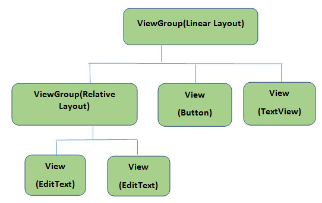

<!-- Front-matter, Data about the file, metadata-->
---

**Tytle : General Properties of Markdown files.**
**Author : Shyed Shahriar Housaini.**

---


<!-- Markdown has html style comments-->

 <!-- Headings -->
# 

## What is Markdown?
#### (Files with the .md or .markdown extension.)
### Markdown is a lightweight and easy-to-use syntax for styling all forms of writing.

#### Markdown is a way to style text on the web. You control the display of the document; formatting words as bold or italic, adding images, and creating lists are just a few of the things we can do with Markdown. Mostly, Markdown is just regular text with a few non-alphabetic characters thrown in, like # or *.


Syntax guide
---
Here’s an overview of Markdown syntax that you can use anywhere on GitHub.com or in your own text files.

It's very easy to make some words **bold** and other words *italic* with Markdown. You can even [link to Google!](http://google.com)
It's very easy to make some words bold and other words italic with Markdown. You can even link to Google!


Headers
# This is an <h1> tag
## This is an <h2> tag
###### This is an <h6> tag
Emphasis
*This text will be italic*
_This will also be italic_

**This text will be bold**
__This will also be bold__

_You **can** combine them_
Lists

Sometimes you want numbered lists:

1. One
2. Two
3. Three

Sometimes you want bullet points:

* Start a line with a star
* Profit!

Alternatively,

- Dashes work just as well
- And if you have sub points, put two spaces before the dash or star:
  - Like this
  - And this
Sometimes you want numbered lists:

One
Two
Three
Sometimes you want bullet points:

Start a line with a star
Profit!
Alternatively,

Dashes work just as well
And if you have sub points, put two spaces before the dash or star:
Like this
And this

Unordered
* Item 1
* Item 2
  * Item 2a
  * Item 2b
Ordered
1. Item 1
1. Item 2
1. Item 3
   1. Item 3a
   1. Item 3b
Images

Format: 
Links
http://github.com - automatic!
[GitHub](http://github.com)
Blockquotes
As Kanye West said:

> We're living the future so
> the present is our past.
Inline code
I think you should use an
`<addr>` element here instead.

H1
=

H1
-

H1
=====

## Heading 2
### Heading 3 <!-- Each # reduces the size of header text  -->
#### Heading 4
##### Heading 5 
###### Heading 6 <!-- Each # reduces the size of header text  -->

<!-- show * -->
\*This text\*

<!-- Italics -->
*This text* is italic

_This text_ is italic

<!-- Strong or Bold -->
**This text** is strong

__This text__ is bold

<!-- Strikethrough -->
~~This text~~ is strikethrough

<!-- Show ~~ -->
\~~This text\~~ 
\~This text\~ <!-- on same line-->

<!-- show * -->
\*This text\*

<!-- show * -->
\**This text\**

<!-- Horizontal Rule -->

***
---
___

<!-- Blockquote -->
> This is a quote


<!-- Blockquote -->
> This is a quote
> This is a quote> This is a quote <!-- on same line-->


<!-- Links -->
[Traversy Media](http://www.traversymedia.com)

[Traversy Media](http://www.traversymedia.com "Traversy Media")

<!-- unordered list UL -->
* Item 1

======

* Item 2
* Item 3
  * Nested Item 1
  * Nested Item 2

<!-- OL -->
1. Item 1
1. Item 2
1. Item 3
  * item 1 in 3
      * item 1 in 3.1

+ One
+ Two
+ Three
  - One
- One
- Two
    + Two
- Three

<!-- Inline Code Block -->
`<p>This is a paragraph</p>`

If you want to embed images, this is how you do it:


<!-- Images -->


<!-- Images -->


<!-- Github Markdown -->

Github Markdown

<!-- Programming Code Blocks -->


```
  npm install

  npm start
```

<!-- adding a language -->
```bash  
  npm install

  npm start
```

```javascript
  function add(num1, num2) {
    return num1 + num2;
  }
```

```python
  def add(num1, num2):
    return num1 + num2
```

<!-- Tables -->
| Name     | Email          |
| -------- | :--------------|
| John Doe | john@gmail.com |
| Jane Doe | jane@gmail.com |

<!-- Task List -->
* [x] Task 1
* [x] Task 2
* [ ] Task 3


# TOC (level 2 and level 3)

[Table of Contents Extension](https://github.com/vsch/flexmark-java/wiki/Table-of-Contents-Extension)
[TOC]


Markdown CheatSheet
====================

# 1. Basic

# H1
## H2
### H3
#### H4
##### H5
###### H6

H1
======

H2
------

*italics* or _italics_.

**bold** or __strong__.

~~Scratch this.~~

# 2. List

1. One
2. Two
3. Three

* One
* Two
* Three

+ One
+ Two
+ Three

- One
- Two
- Three

# 3. Links

[Google](https://www.google.com)

[Google](https://www.google.com "Search Engine")

# 4. Images


# 5. Code

`source code`

```java
package com.mkyong;

import org.springframework.boot.SpringApplication;
import org.springframework.boot.autoconfigure.SpringBootApplication;

@SpringBootApplication
public class StartApplication {
    //...   
}
```

```javascript
var s = "markdown";
alert(s);
```


```html
<html>
</html>
```

# 6. Tables

| Header1 | Header2 | Header1 | Header2 |
| :------:| :-------:| :-----:| :------:|
| A1      | A2       | A3     |         |
| B1      | B2       | B3     |         |
| C1      | C2       | C3     |         |


Table: This is a table caption  
# 7. Blockquotes

> line 1

> line 2

> line line line line line line line line line line line line line line line line line line line line line line 


# 8. Line

---

***
___

# 9. TOC (level 2 and level 3)

[Table of Contents Extension]
(https://github.com/vsch/flexmark-java/wiki/Table-of-Contents-Extension)

[TOC]

References
======
1. [Markdown Cheatsheet](https://github.com/adam-p/markdown-here/wiki/Markdown-Cheatsheet)


Why Use Markdown?
=======
You might be wondering why people use Markdown instead of a WYSIWYG editor. Why write with Markdown when you can press buttons in an interface to format your text? As it turns out, there are a couple different reasons why people use Markdown instead of WYSIWYG editors.

Markdown can be used for everything. People use it to create websites, documents, notes, books, presentations, email messages, and technical documentation.

Markdown is portable. Files containing Markdown-formatted text can be opened using virtually any application. If you decide you don’t like the Markdown application you’re currently using, you can import your Markdown files into another Markdown application. That’s in stark contrast to word processing applications like Microsoft Word that lock your content into a proprietary file format.

Markdown is platform independent. You can create Markdown-formatted text on any device running any operating system.

Markdown is future proof. Even if the application you’re using stops working at some point in the future, you’ll still be able to read your Markdown-formatted text using a text editing application. This is an important consideration when it comes to books, university theses, and other milestone documents that need to be preserved indefinitely.

Markdown is everywhere. Websites like Reddit and GitHub support Markdown, and lots of desktop and web-based applications support it.

# Structured documents

Sometimes it's useful to have different levels of headings to structure your documents. Start lines with a `#` to create headings. Multiple `##` in a row denote smaller heading sizes.

### This is a third-tier heading

You can use one `#` all the way up to `######` six for different heading sizes.

If you'd like to quote someone, use the > character before the line:

># Coffee. The finest organic suspension ever devised... I beat the Borg with it.
> - Captain Janeway
Structured documents
Sometimes it’s useful to have different levels of headings to structure your documents. Start lines with a # to create headings. Multiple ## in a row denote smaller heading sizes.

This is a third-tier heading
You can use one # all the way up to ###### six for different heading sizes.

If you’d like to quote someone, use the > character before the line:

Coffee. The finest organic suspension ever devised… I beat the Borg with it. - Captain Janeway. 
GitHub supports many extras in Markdown that help you reference and link to people. If you ever want to direct a comment at someone, you can prefix their name with an @ symbol: Hey @kneath — love your sweater!

But I have to admit, tasks lists are my favorite:

- [x] This is a complete item
- [ ] This is an incomplete item

When you include a task list in the first comment of an Issue, you will see a helpful progress bar in your list of issues. It works in Pull Requests, too!

And, of course emoji!
GitHub supports many extras in Markdown that help you reference and link to people. If you ever want to direct a comment at someone, you can prefix their name with an @ symbol: Hey @kneath — love your sweater!

But I have to admit, tasks lists are my favorite:

 This is a complete item
 This is an incomplete item
When you include a task list in the first comment of an Issue, you will see a helpful progress bar in your list of issues. It works in Pull Requests, too!

And, of course emoji!


<!--The most platform-independent syntax is

(empty line)
[comment]: # (This actually is the most platform independent comment)
Both conditions are important:

Using # (and not <>)
With an empty line before the comment. Empty line after the comment has no impact on the result.
The strict Markdown specification CommonMark only works as intended with this syntax (and not with <> and/or an empty line) -->


<!-- I use standard HTML tags, like
your comment goes here
and here
-->
<!-- // Comments:-


Note the triple dash. The advantage is that it works with pandoc when generating TeX or HTML output. More information is available on the pandoc-discuss group.
I believe that all the previously proposed solutions (apart from those that require specific implementations) result in the comments being included in the output HTML, even if they are not displayed.

If you want a comment that is strictly for yourself (readers of the converted document should not be able to see it, even with "view source") you could (ab)use the link labels (for use with reference style links) that are available in the core Markdown specification:

http://daringfireball.net/projects/markdown/syntax#link

That is:

[comment]: <> (This is a comment, it will not be included)
[comment]: <> (in  the output file unless you use it in)
[comment]: <> (a reference style link.)
Or you could go further:

[//]: <> (This is also a comment.)
To improve platform compatibility (and to save one keystroke) it is also possible to use # (which is a legitimate hyperlink target) instead of <>:

[//]: # (This may be the most platform independent comment)
For maximum portability it is important to insert a blank line before and after this type of comments, because some Markdown parsers do not work correctly when definitions brush up against regular text. The most recent research with Babelmark shows that blank lines before and after are both important. Some parsers will output the comment if there is no blank line before, and some parsers will exclude the following line if there is no blank line after.

In general, this approach should work with most Markdown parsers, since it's part of the core specification. (even if the behavior when multiple links are defined, or when a link is defined but never used, is not strictly specified).


 // Comment You're looking at a document that doubles as a .pdf CV and a html webpage. However you're viewing this, welcome! A lot of relevant information about me is here.

You can download this in printable form at [https://lukesmith.xyz/lukesmith.pdf](https://lukesmith.xyz/lukesmith.pdf) or see it in HTML form at [https://digitalbd.org](https://digitalbd.org).
-->